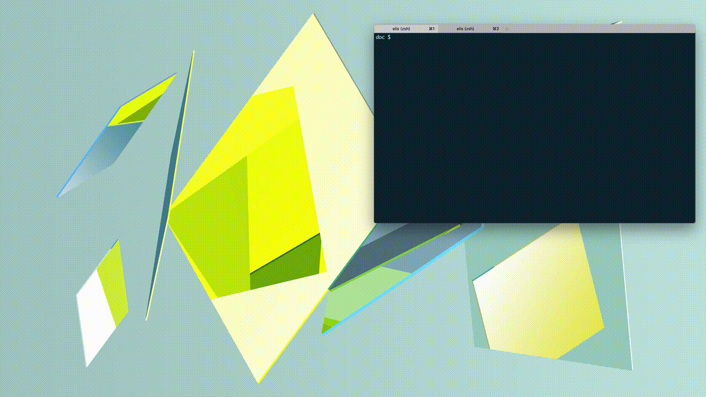
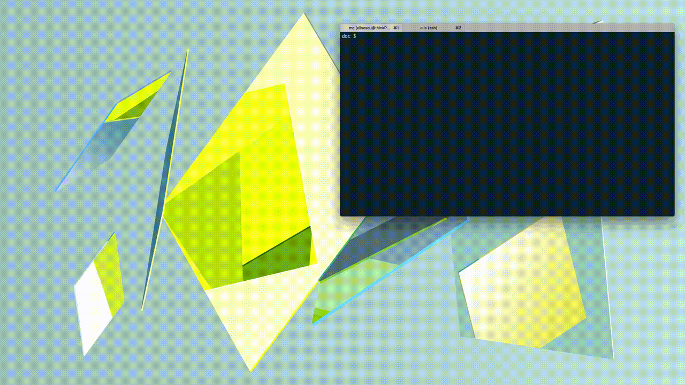

[](https://travis-ci.com/elisescu/tty-share)

# tty-share

[tty-share](https://tty-share.com) is a very simple tool used to share your Linux/OSX terminal over the Internet. It is written in GO, results in a static cross-platform binary with no dependencies, and therefore will also work on your Raspberry Pi.

The remote participant needs **not setup**, and they can join the session from the browser or from the terminal (`tty-share <secret URL>`). The session can be shared either over the Internet, or only in the local network. When sharing it over the Internet (outside your NAT), `tty-share` will connect to [proxy server](https://github.com/elisescu/tty-proxy) that will mediate the communication between the participants. An instance of this server runs at [tty-share.com](https://tty-share.com), but you can run your own.

## Demos

*Local network session*


*Public session*


*Join a session from another terminal*


## Installing and running

**Docker**

If you only want to try it out, there's a Docker image you can use:
```bash
docker run -it elisescu/tty-share --public
```

**Brew**

If you are on OSX and use [brew](https://brew.sh/), then you can simply do a `brew install tty-share`.

**Binary releases**

Otherwise, download the latest `tty-share` binary [release](https://github.com/elisescu/tty-share/releases), and run it:

**Running it**
```
~ $ tty-share --public
public session: https://on.tty-share.com/s/L8d2ECvHLhU8CXEBaEF5WKV8O3jsZkS5sXwG1__--2_jnFSlGonzXBe0qxd7tZeRvQM/
local session: http://localhost:8000/s/local/
Press Enter to continue!

~ $
```

Sessions can be created as read only, with the `--readonly` flag. See `--help` for more.

**Join a session**

You can join a session by opening the session URLs in the browser, or with another `tty-share` command:
```bash
~ $ tty-share https://on.tty-share.com/s/L8d2ECvHLhU8CXEBaEF5WKV8O3jsZkS5sXwG1__--2_jnFSlGonzXBe0qxd7tZeRvQM/
```

**Join a session with TCP port forwarding**

You can use the `-L` option to create a TCP tunnel, similarly to how you would do it with `ssh`:
```
tty-share -L 1234:example.com:4567 https://on.tty-share.com/s/L8d2ECvHLhU8CXEBaEF5WKV8O3jsZkS5sXwG1__--2_jnFSlGonzXBe0qxd7tZeRvQM/
```
This will make `tty-share` listen locally on port `1234` and forward all connections to `example.com:4567` from the remote side.
The server needs to allow this, by using the `-A` flag.


## Building

Simply run
```
go get github.com/elisescu/tty-share
```

The frontend code (the code that runs in the browser session) lives under `server/frontend`, and it is compiled into `server/assets_bundle.go` go file, committed to this git repo. To rebuild this bundle of web resources, make sure you have `node` and `npm` installed, and then run: `make -C server frontend`. Unless you change the browser/frontend code, you don't need to do this - the code is already precompiled and bundled in `assets_bundle.go`.

For cross-compilation you can use the GO building [environment variables](https://golang.org/doc/install/source#environment). For example, to build the `tty-share` for raspberrypi, you can do `GOOS=linux GOARCH=arm GOARM=6 go build` (check your raspberrypi arch with `uname -a`).

## Security

`tty-share` connects over a TLS connection to the server, which uses a proxy for the SSL termination, and the browser terminal is served over HTTPS. The communication on both sides is encrypted and secured, in the same way as other similar tools are doing it (e.g. tmate, VSC, etc).

However, end-to-end encryption is on the TODO list. Otherwise, if you don't trust my [tty-proxy](https://github.com/elisescu/tty-proxy) installation, you can run your own.


## Similar solutions

### VSC (Visual Studio Code) [Live Share](https://docs.microsoft.com/en-us/visualstudio/liveshare/use/vscode)

I've tried Visual Studio Code sharing, and it seems to work relatively well. One big advantage is that both persons in the session can write code, and navigate independently of each other. It also supports terminal sharing.

However, the two disadvantages with this tool are the need of logging in with a Github (or Microsoft) account, and having to install Visual Studio Code on the remote side too. I don't want to force the remote person to install VSC just for them to get access to a terminal session. Visual Studio Code might be popular in the web development circles, but it is not popular in the other development corners.

### [tmate.io](https://tmate.io/)

This is a great tool, and I used it quite a few times before. At the time I started my project, [tmate.io](https://tmate.io) didn't have the option to join the session from the browser, and one had to use `ssh`. In most cases, `ssh` is not a problem at all - in fact it's even preferred, but there are cases when you just don't have easy access to an `ssh` client, e.g.: joining from a Windows machine, or from your smartphone. In the meantime, the project added some support for joining a terminal session in the browser too.

Perhaps one downside with *tmate* is that it comes with quite a few dependencies which can make your life complicated if you want to compile it for ARM, for example. Running it on a raspberry pi might not be as simple as you want it, unless you use Debian.

## Credits

* [xterm.js](https://xtermjs.org/) - used in the browser receiver.
* [gotty](https://github.com/yudai/gotty) - used for inspiration and motivation.
* [tmate](https://tmate.io/) - inspiration and motivation.
* [https://codepen.io/chiaren/pen/ALwnI](https://codepen.io/chiaren/pen/ALwnI) - for the free 404 page.
